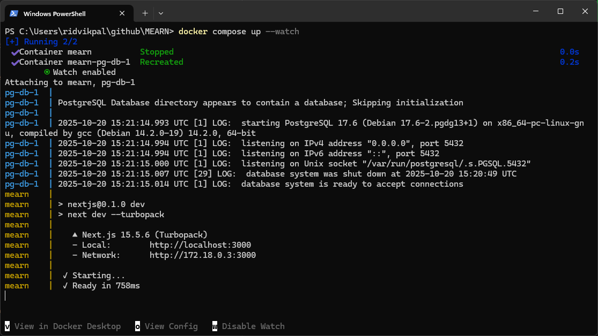

## Project management

This project utilizes [GitHub Projects](https://github.com/users/Niraaj-Rajalingam/projects/1) and (GitHub Issues)[https://github.com/Niraaj-Rajalingam/MEARN/issues] for Project Management.

## Getting started for development

1. Make sure you have [node.js](https://nodejs.org/en/download) and [docker](https://www.docker.com/get-started/) installed on your machine.
2. Navigate to this repo's directory and run `npm install`. This will install all dependencies locally for you to get code writing assistance in your IDE (e.g., VSCode Intellisense)
3. Run `docker compose up --watch` to actually run the web app in development mode at http://localhost:3000. Hot reload is enabled with the `--watch` command so any changes to code will be reflected in the web app on file save.
4. If you modify your node dependencies, simply cancel (Ctrl+C a few times) and restart the `docker compose up --watch` command to reload your dependencies.

Note that this development environment uses a postgres database, with the data persisted across sessions in the `pg-db-data` docker volume. If you want to clear your database, simply delete the docker volume with `docker volume rm pg-db-data`.

## Deploy on Vercel

The easiest way to deploy your Next.js app is to use the [Vercel Platform](https://vercel.com/new?utm_medium=default-template&filter=next.js&utm_source=create-next-app&utm_campaign=create-next-app-readme) from the creators of Next.js.

Check out our [Next.js deployment documentation](https://nextjs.org/docs/app/building-your-application/deploying) for more details.
